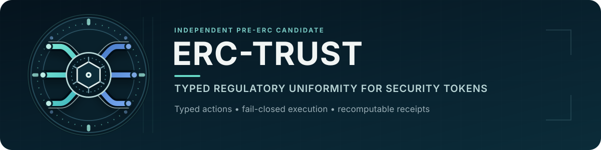
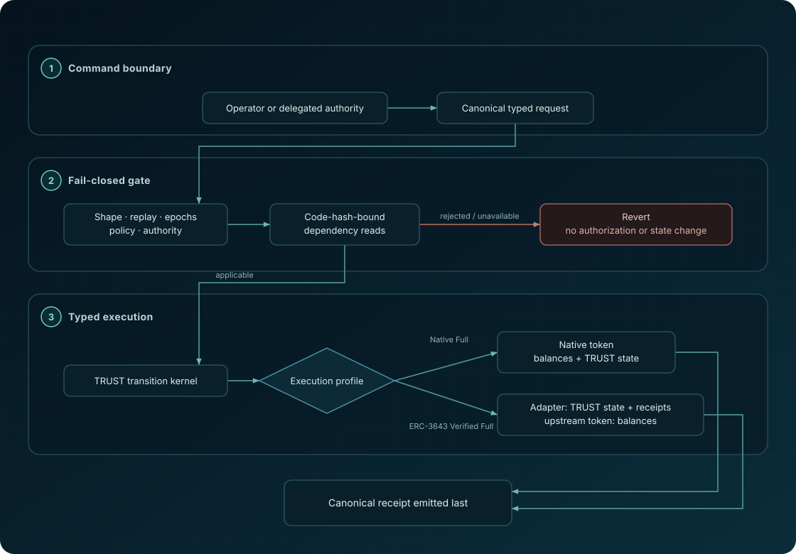
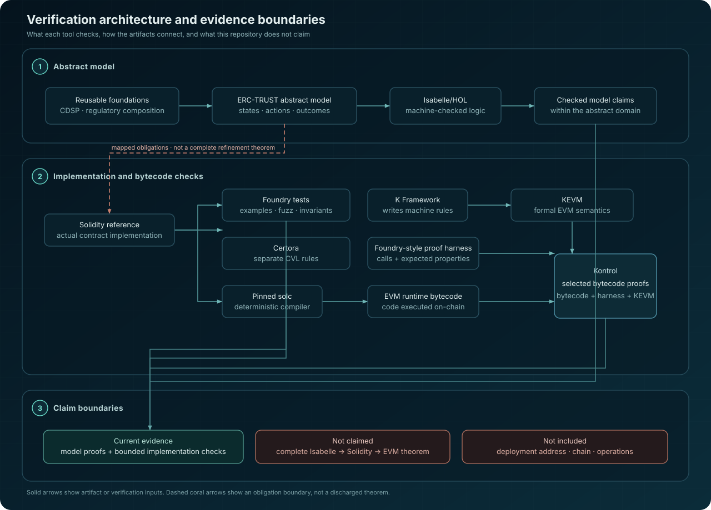

<div align="center">
  

  <p><strong>A typed, fail-closed execution standard candidate for regulatory actions on security tokens.</strong></p>

  [](https://github.com/Oraclizer/erc-trust/actions/workflows/ci.yml)
  [](https://github.com/Oraclizer/erc-trust/actions/workflows/identity.yml)
  [](https://github.com/Oraclizer/erc-trust/actions/workflows/proofs.yml)
  [](https://arxiv.org/abs/2608.29134)
  [](https://github.com/Oraclizer/erc-trust/actions/workflows/ci.yml)
  [](LICENSE)

  [Draft](docs/ERC-DRAFT.md) |
  [Architecture](docs/ARCHITECTURE.md) |
  [Integration](docs/INTEGRATION.md) |
  [Profiles](docs/PROFILES.md) |
  [Verification](FORMAL_VERIFICATION.md) |
  [Paper](https://arxiv.org/abs/2608.29134) |
  [Community review](docs/COMMUNITY-REVIEW.md)
</div>

> **Unaudited. Not for production.** No deployment, proxy, migration, or
> external legal or factual truth is verified. ERC-TRUST is a pre-ERC
> candidate. No ERC number has been assigned or assumed.

## Standards track status

ERC-TRUST is a conformance extension of the proposed **ERC-8319**
(Regulatory Compliance Protocol). ERC-8319 is an open, not-yet-merged Draft
at [ethereum/ERCs PR #1848](https://github.com/ethereum/ERCs/pull/1848). The
official ERC-TRUST proposal will be submitted after ERC-8319 merges, with the
intended preamble `requires: 20, 165, 7943, 8319`; until then ERC-TRUST has
no official ERC number and [`docs/ERC-DRAFT.md`](docs/ERC-DRAFT.md) is the
working draft.

## Research paper

The accompanying paper,
[Mechanizing Typed Regulatory Actions for Security Tokens: Semantics, Falsification, and Bounded EVM Evidence](https://arxiv.org/abs/2608.29134),
sets out the Isabelle/HOL semantics, falsification strategy, and bounded
implementation-evidence boundary. The repository remains the executable
artifact and exact candidate SSOT; the paper does not turn bounded evidence
into an audit, deployment verification, compiler-correctness result, or a
complete Isabelle-to-EVM refinement theorem.

## The problem

Security-token systems expose privileged mechanics such as freezing balances
or forcing transfers. A primitive alone does not identify the regulatory
meaning of an operation, the authority and evidence that permitted it, whether
it may be replayed or reversed, or the receipt that an independent observer
should recompute.

ERC-TRUST binds those concerns without claiming that software can establish
the underlying legal facts.

| Layer | Question | ERC-TRUST contribution |
| --- | --- | --- |
| Meaning | What regulatory action is requested? | Six typed actions with separate reversal semantics |
| Mechanism | How is the token state changed? | Native execution, an exact-use ERC-7943 route, or a sealed ERC-3643 adapter |
| Assurance | What evidence applies to this exact candidate? | Recomputable receipts, claim matrices, pinned builds, and bounded verification rows |

## Candidate at a glance

The immutable native reference implements:

- the six typed actions `FREEZE`, `SEIZE`, `CONFISCATE`, `LIQUIDATE`,
  `RESTRICT`, and `RECOVER`;
- the separate `UNFREEZE`, `RELEASE`, and `UNRESTRICT` reversals;
- ERC-20, ERC-165, and the ERC-7943 fungible interface;
- exactly-once action identifiers and authority nonces;
- distinct `Rejected` and `OperationalFailure` outcomes with revert stutter;
- versioned, runtime-code-hash-bound policy, identity, settlement, and
  entitlement views;
- same-transaction exact-use tickets for sensitive ERC-7943 selectors;
- custody, settlement, proceeds, and one-time entitlement records;
- a final canonical receipt emitted after token and compatibility events.

The optional ERC-3643 Verified Full profile uses a separate adapter. It reports
Full only when a one-way `ProfileGovernor` seals the expected token runtime
code hash, token owner, Identity Registry, Compliance contract, and exclusive
adapter Agent. Ordinary ERC-3643 deployments do not automatically qualify.

Proxy and migration support are intentionally `false` in candidate v1. The
native runtime is 24,142 bytes under the pinned compiler settings, leaving 434
bytes below the EIP-170 limit. Any native source change requires the full
size, test, proof, mutation, and manifest replay.

## Architecture

<div align="center">
  
</div>

The native token owns balances and TRUST state. The ERC-3643 adapter owns
TRUST state and receipts while the upstream token owns balances. Every
external response is treated as a bound input, never as proof that a legal,
identity, settlement, entitlement, or ownership claim is true.

The Native Full path gates sensitive ERC-7943 selectors behind a
same-transaction exact-use ticket. The ERC-3643 path rechecks a sealed
`ProfileGovernor` topology before using the upstream token, Identity Registry,
or Compliance contract.

See [Architecture and trust boundaries](docs/ARCHITECTURE.md) for component
ownership, action flow, failure behavior, and deployment boundaries.

## Choose a profile

| Profile | Intended use | Full-status condition |
| --- | --- | --- |
| Native Full v1 | New immutable ERC-20 deployment | Exact source, compiler settings, and bound read-only dependencies |
| ERC-3643 Verified Full v1 | Existing ERC-3643 topology | Sealed runtime code hash, inert owner, and exclusive adapter Agent |
| ERC-3643 Partial | Integration that cannot prove every topology condition | Must identify every missing Full condition |
| Unsupported | Missing or contradictory evidence | No reliable conformance declaration |

No deployment manifest is included because this repository claims no
deployment. A deployment must bind exact runtime bytecode, compiler settings,
addresses, roles, dependency epochs, and the evidence manifest.

## Quickstart

### Prerequisites

- Foundry `1.7.1`
- Solidity `0.8.36`, selected through `foundry.toml`
- Node.js `24.14.0`
- pnpm `11.9.0`

Exact pins are recorded in
[`evidence/release-manifest.json`](evidence/release-manifest.json).

### Build and test the Solidity candidate

```bash
forge fmt --check
forge build --sizes
forge test --fuzz-runs 256 -vv
forge lint
```

### Build and test the operator SDK

```bash
corepack enable
corepack prepare pnpm@11.9.0 --activate
pnpm --dir sdk install --frozen-lockfile --ignore-scripts
pnpm --dir sdk test
```

### Verify generated artifacts and public surface

```bash
node scripts/generate-vectors.mjs
forge build
node scripts/generate-release-manifest.mjs
node scripts/verify-release.mjs
node scripts/verify-links.mjs
node scripts/verify-public-surface.mjs
node scripts/verify-repository-health.mjs
node scripts/verify-current-profile-release.mjs
```

On Windows, the complete current-profile release replay is:

```powershell
powershell -NoProfile -ExecutionPolicy Bypass -File scripts/replay-current-profile-release.ps1
```

Start with the [integration guide](docs/INTEGRATION.md) before constructing a
request. Operators must not call `setFrozenTokens` or `forcedTransfer` as
shortcuts. The native reference rejects raw calls.

## Assurance snapshot

Most of this repository is proof, not implementation. By line count, the
machine-checked formal artifacts outweigh the Solidity reference
implementation roughly five to one, which is why the repository language bar
is dominated by K and Isabelle rather than Solidity:

| Layer | Files | Lines | What it is |
| --- | --- | --- | --- |
| KEVM proof specifications | 248 | 35,114 | Bytecode-level proof claims and lemmas for the compiled runtime, including generated claim bundles |
| Isabelle/HOL theories | 30 | 8,661 | The abstract model and its mechanically checked theorems |
| Certora rules | 28 | 1,105 | Bounded rules and mutator classifications against the Solidity source |
| Solidity reference implementation | 22 | 9,062 | The contract code those artifacts are about |

To our knowledge, no ERC before this one has shipped machine-checked formal
artifacts of this depth as part of the proposal itself. The boundaries of
what that evidence does and does not establish are stated below and are part
of the claim.

<div align="center">
  
</div>

The verification layers are complementary, not interchangeable. Solid paths
show actual artifact or verification inputs. The coral obligation boundary
does not claim a complete Isabelle-to-Solidity-to-EVM refinement theorem, and
the deployment boundary remains separate from repository evidence.

Candidate `0.1.0-candidate.1` has the following exact disposition:

| Layer | Result |
| --- | --- |
| Foundry | 31/31 tests; two fuzz properties with 256 runs each; three invariants with 384,000 total calls |
| Certora | 7/7 bounded core rules and 12/12 external mutator classifications |
| Kontrol and KEVM | 3/3 selected high-risk bytecode proofs |
| Mutation | 11/11 declared reference-candidate faults detected |
| Deterministic build | Two isolated clean builds produced identical artifact and bytecode hashes |
| Isabelle/HOL abstract model | Mechanically verified within the declared abstract semantic domain |
| Mandatory current profile | Seven reusable packages, 49/49 Core rows, and 24/24 Supporting rows qualified; optional assurance backlog 0/6 |
| SDK | 3/3 tests and a minimal dry-run package |

The exact runs, hashes, harnesses, qualifiers, and replay commands are in the
[verification summary](evidence/verification-summary.md) and
[release manifest](evidence/release-manifest.json).

These results do not establish:

- an independent security audit;
- production safety or fitness for a particular purpose;
- a machine-checked Isabelle-to-Solidity-to-EVM refinement theorem;
- a verified deployment, proxy, migration, address, chain, or key-management
  process;
- the truth of an external policy, identity, legal, settlement, proceeds,
  entitlement, or ownership assertion.

The official Isabelle/Solidity AFP framework was inspected and clean-built.
Its candidate disposition is
[NOT APPLICABLE](evidence/isabelle-solidity-applicability.md) because the
available shallow translation does not cover the implementation's principal
stateful, external-call, revert, compiled-route, and event-order risks. The
implementation-level TRUST-REF obligations were instead discharged within
their stated boundaries through Foundry, Certora, Kontrol, mutation testing,
deterministic builds, and provenance.

## Documentation

| Document | Use it for |
| --- | --- |
| [Pre-ERC draft](docs/ERC-DRAFT.md) | Proposed normative interface and conformance language |
| [Architecture](docs/ARCHITECTURE.md) | Components, ownership, flows, and trust boundaries |
| [Integration](docs/INTEGRATION.md) | Build, request lifecycle, receipt handling, and failure behavior |
| [Profiles](docs/PROFILES.md) | Native and ERC-3643 conformance declarations |
| [Formal verification](FORMAL_VERIFICATION.md) | Model ownership and model-to-implementation evidence |
| [TRUST-REF matrix](evidence/trust-ref-matrix.md) | Obligation-by-obligation evidence |
| [Public claim matrix](evidence/claim-matrix.md) | Allowed and forbidden claims |
| [Community review](docs/COMMUNITY-REVIEW.md) | Questions for standards and implementation reviewers |
| [Disclaimer](DISCLAIMER.md) | Plain-language use, legal, and deployment boundaries |
| [Security policy](SECURITY.md) | Private vulnerability reporting |

## Related research and formal artifacts

ERC-TRUST is an independent pre-ERC candidate. The resources below provide
its broader regulatory and formal-methods context.

- [Regulatory Compliance Protocol (RCP)](https://arxiv.org/abs/2603.29278)
  provides the regulatory-coverage benchmark from which the typed-action
  problem was distilled.
- [The Cross-Domain State Preservation Functor](https://arxiv.org/abs/2604.03844)
  develops the model-level state-preservation framework in Isabelle/HOL.
- [Oraclizer formal-verification](https://github.com/Oraclizer/formal-verification)
  publishes the reusable Isabelle/HOL artifacts that the formal work here
  builds on; the scope of each layer is recorded in FORMAL_VERIFICATION.md.

## Repository layout

| Path | Role |
| --- | --- |
| `implementation/src/` | Native reference and ERC-3643 profile |
| `implementation/test/` | Unit, fuzz, invariant, and profile tests |
| `implementation/certora/` | Bounded Certora Verification Language rules and configurations |
| `implementation/kontrol/` | KEVM high-risk cross-checks |
| `sdk/` | Deterministic TypeScript request, receipt, and calldata helpers |
| `schemas/` | Canonical receipt schema |
| `vectors/` | Positive and negative conformance vectors |
| `evidence/` | Claim, provenance, mutation, proof, and release manifests |
| `formal/isabelle/ERC_TRUST/` | Abstract regulatory-action model and model-verification evidence |
| `pilot/` | Preserved Native FREEZE vertical slice |

### Tooling and language map

| Language or format | Purpose in this repository |
| --- | --- |
| Solidity | Immutable reference implementation, compatibility profiles, and Foundry unit, fuzz, and invariant tests |
| Isabelle/HOL | Abstract action semantics and model-level theorems, with their exact scope recorded in FORMAL_VERIFICATION.md |
| PowerShell | Windows orchestration for deterministic builds, mutation campaigns, and abstract-model evidence closure |
| JavaScript (Node.js `.mjs`) | Conformance vectors, manifests, hash binding, link checks, and public-surface/repository-health validation |
| TypeScript | Operator SDK for typed requests, identifiers, hashes, calldata, receipts, and associated tests |
| Certora Verification Language (`.spec`) | Bounded implementation and pilot rules; excluded from GitHub's language bar because Linguist otherwise misidentifies this DSL as Python |
| K Framework (Kontrol/KEVM `.k`) | Selected bytecode-level, high-risk cross-check assertions |
| YAML, TOML, JSON, and LaTeX | CI, build configuration, schemas, evidence records, and generated formal documentation |

Generated build output, prover caches, mutation workspaces, private logs, and
local environment state do not belong in the tracked public tree.

## Version and release policy

`0.1.0-candidate.1` identifies the current unaudited reference candidate. A
GitHub tag or release does not exist yet. Tags, releases, deployment claims,
and a production designation require separate maintainer approval and must
bind an exact commit and manifest. A later ERC number, if assigned, will not
retroactively make older implementation commits audited or production-ready.

## Security, support, and contributions

- Report potential vulnerabilities through the private path in
  [SECURITY.md](SECURITY.md). Do not disclose exploit details in a public
  issue.
- Use [SUPPORT.md](SUPPORT.md) to distinguish usage questions from defects
  and security reports.
- Read [CONTRIBUTING.md](CONTRIBUTING.md) before proposing a specification,
  implementation, proof, or documentation change.
- Project decision and merge rules are documented in
  [GOVERNANCE.md](GOVERNANCE.md).
- Participation is governed by the
  [Code of Conduct](CODE_OF_CONDUCT.md).

## License, citation, and provenance

First-party content in this repository is copyright Oraclizer Labs, Inc.
Licensing follows the path:

- Code, tests, scripts, the SDK, and the formal artifacts:
  [BSD 3-Clause License](LICENSE), copyright Oraclizer Labs, Inc.
- The proposed ERC text in [`docs/ERC-DRAFT.md`](docs/ERC-DRAFT.md):
  copyright and related rights waived under
  [CC0 1.0 Universal](docs/LICENSE-CC0.md), matching the public-domain
  requirement for EIP/ERC documents. The waiver does not change the license
  of the reference implementation.
- The accompanying TRUST paper: CC BY 4.0, published separately from this
  repository.

The BSD 3-Clause License includes warranty and liability limitations.
[DISCLAIMER.md](DISCLAIMER.md) provides a plain-language summary but does not
replace either license or waiver.

ERC-3643 compatibility declarations are clean-room interface signatures. No
GPL implementation source is copied or adapted. See the
[provenance record](evidence/clean-room-provenance.md).

Academic and standards references can use [CITATION.cff](CITATION.cff).
Contributions use the license applicable to the changed path as described in
[CONTRIBUTING.md](CONTRIBUTING.md).

The standalone [ERC-TRUST project mark](docs/assets/erc-trust-mark.svg)
identifies this independent project; it implies no endorsement by the
Ethereum Foundation, Ethereum core contributors, or EIP/ERC editors, and no
assigned ERC number.
