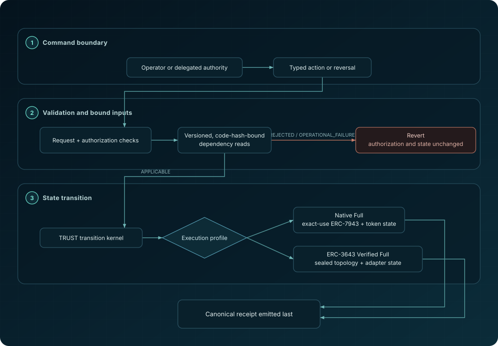
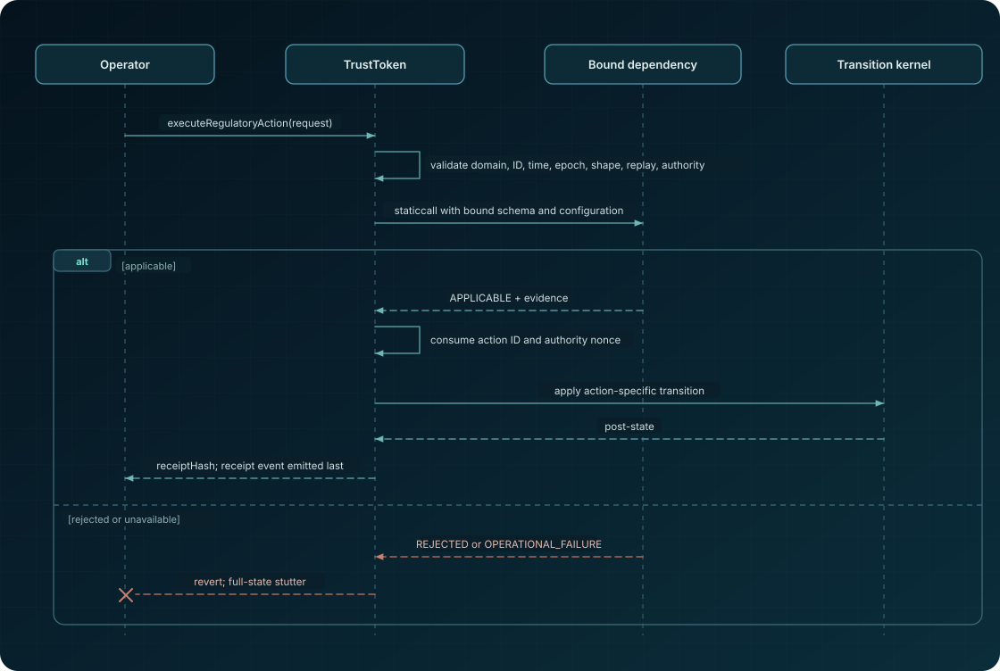
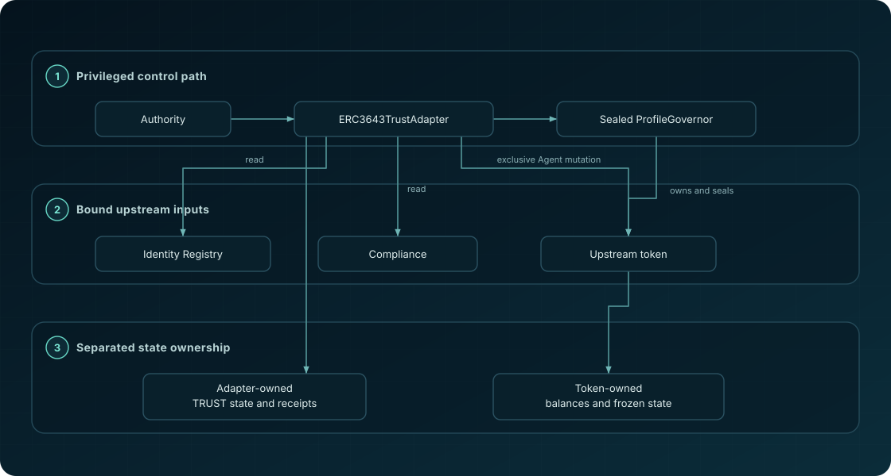

# Architecture and trust boundaries

ERC-TRUST separates three questions that privileged token interfaces commonly
collapse: the regulatory meaning of a command, the mechanism that changes token
state, and the evidence supporting a claim about this implementation.

> [!WARNING]
> This document describes an unaudited reference candidate, not a verified
> deployment. It does not establish legal authority or the truth of any
> external input.

## System view

  

A typed command commits to its authority and authority epoch, its case, the
endpoint's current dependency root and epoch, its validity window and nonce,
its provenance, and its action-specific commitments. The endpoint validates
the command in a fixed order (domain, identifier, replay, window, authority,
dependency pair, nonce, field rules, state-dependent rules), assesses its
bound dependencies, applies the transition, and only then stores and emits
the receipt as the final log. Every failure reverts and leaves the endpoint
exactly as it was, so no identifier or nonce is consumed by a failed command.

## Component ownership

| Component | Owns | Reads or calls | Must not be treated as |
| --- | --- | --- | --- |
| `TrustToken` | ERC-20 balances, frozen targets and restriction flags, cases and overlay heads, custody records and backing, action records, receipts, replay keys, authorities, dependency bindings and the dependency root | Four bound read-only dependencies | A legal adjudicator or a deployment |
| `TrustNativeDecision` | Pure shape and case-transition helpers of the native token | Request fields and stored records | An external-fact oracle |
| `TrustDependencyBinding` | Per-kind binding hash (address, runtime code, configuration digest, schema, per-kind epoch) and the ordered dependency root | Bound dependency metadata | A guarantee that dependency output is true |
| `ERC7943RouteTicket` | The exact-use route ticket of the sensitive ERC-7943 selectors | The current wrapper call | Standing authority for raw ERC-7943 calls |
| `ERC3643TrustAdapter` | Partial-reference kernel state over a sealed ERC-3643 token: cases, custody, owned frozen targets and restriction flags, receipts, the single immutable authority | Upstream token, Identity Registry, Compliance, the sealed topology | Proof of manifest completeness or Full conformance |
| `ProfileGovernor` | The one-way topology seal and declared-entry manifest | Token code identity, owner, registries, exclusive Agent, included upstream entries at the seal | A completeness oracle or general-purpose administrator |
| Operator SDK | Deterministic identifiers, hashes, and calldata | Caller-provided request data | A signer, relayer, fact checker, or policy engine |

The kernel types and interfaces that every component consumes are generated
from the machine-readable kernel source (`spec/erc-trust-kernel-v2.json`)
into `implementation/src/generated/IERCTrustKernel.sol`; the generator's check
mode rejects any drift between that copy and `spec/generated/`.

## Native Full

`TrustToken` is an immutable ERC-20, ERC-165, and ERC-7943 fungible
implementation and the sole owner of balances and regulatory state. It
exposes no proxy, `delegatecall`, `selfdestruct`, public mint, or public burn
surface.

The four external dependencies (policy, identity, settlement, entitlement)
are read-only `ITrustBoundDependency` endpoints. Each binding records the
dependency address, runtime code identity, configuration digest, schema, and
per-kind epoch; the four bindings are folded, in `BindingKind` order, into
one dependency root, and every rebind of any kind advances the global
dependency epoch by one. A command that carries a stale root or epoch is
rejected before any state-dependent rule. Calls fail closed when the code,
configuration, return length, outcome word, command echo, or binding echo
does not match.

### Native action path

  

The case transition table of the kernel governs every command. `FREEZE`
raises a subject's absolute frozen target and records the prior target;
`UNFREEZE` restores it and pops the head. `RESTRICT` and `UNRESTRICT` do the
same for the restriction flag. `SEIZE` opens the one custody record of its
case and moves the amount to the custodian, where it stays as custody backing
that ordinary transfers cannot spend; `RELEASE` returns the encumbered amount
to the declared prior holder and closes the case. `CONFISCATE`, `LIQUIDATE`,
and `RECOVER` are terminal, either directly against the subject or as a
disposition of the case's custody; `LIQUIDATE` binds settlement and proceeds
commitments and `RECOVER` consumes an entitlement commitment once. A terminal
case accepts no further command, and an overlay owned by another case is
never cleared by a disposition.

## ERC-7943 exact-use route

The sensitive `setFrozenTokens` and `forcedTransfer` selectors are self-call
targets, not public authority surfaces.

1. `executeERC7943Action` or `executeERC7943Reversal` validates, assesses,
   and consumes the complete typed command.
2. The wrapper records one route ticket holding the command identifier, the
   selector, the calldata hash, and the dependency root and epoch current at
   preparation.
3. The token calls its own sensitive selector in the same transaction.
4. The selector compares every recorded field against the call and the
   current dependency state, compares the prepared record against its
   arguments, consumes the ticket, and applies the transition.
5. Reuse, altered calldata, a direct external call, a wrong selector, or a
   dependency change in between reverts with `TrustRouteMismatch`, whose
   identifier is computed only on failure and never stored.

The ticket is not persisted as reusable authority. It exists only during the
validated wrapper path.

## ERC-3643 Partial reference

The adapter profile deliberately separates state ownership:

  

`ERC3643TrustAdapter` owns the kernel state: cases, custody, owned frozen
targets and restriction flags, action records, and receipts. The upstream
token owns balances and its own frozen amounts. `ProfileGovernor` owns the
token and seals the expected token code identity, the token, the adapter,
the Identity Registry, the Compliance contract, the chain, the exclusive-Agent
relationship, and the import manifest.

Onboarding accepts a canonical list of declared entries and verifies each one
against live upstream state. It does not prove that no other legacy account was
omitted, and an empty manifest does not prove a fresh zero state. A declared
frozen amount or address freeze becomes an imported case with a live head, so
declared legacy state is reversible under the transition table. Before every
command the adapter checks that each account it acts on carries exactly the
upstream state it declared or applied (reason 304 otherwise); it never
overwrites or silently adopts upstream state it does not own. After sealing,
`ProfileGovernor` has no arbitrary-call, Agent-management, or registry
rebinding surface, and the adapter rechecks the topology before consuming
any command. Identity Registry and Compliance responses are fail-closed
inputs (reasons 100 and 101 for denials, 402 and 403 for unavailability),
upstream execution is typed (400 and 401), forced transfers recheck the actual
source and destination restriction flags after balance and frozen-target
synchronisation, and custody is confined to the adapter.

Because the token holds a frozen amount and the kernel a frozen target, the
adapter restores both accounts of a forced transfer to their owned targets
saturated at the current balance, and the profile surface offers
`resynchroniseFrozen` for the inbound-growth window described in
`PROFILES.md`. Receipt observations bind actual upstream restriction flags for
the subject, source, and destination.

The repository's clean-room test doubles are conformance harnesses only.
They are not ERC-3643 implementations, and compatibility with them is not
evidence that an external token satisfies this Partial reference, much less a
Verified Full profile.

A future TRUST 1.2 Verified Full profile additionally requires atomic fresh
deployment, a complete initial-state gate, and a same-transaction token or
Compliance hook for every ordinary transfer. It is not implemented here.

## Receipt and observation boundary

Action and reversal receipts share one seventeen-field struct and one
preimage, domain separated by the receipt kind. A receipt commits to the
command identifier and kind, the parent command of a reversal, the subject,
source, destination, amount, case, authority reference, dependency root,
provenance commitment, assessment evidence, pre-state and post-state
observations, and the action-specific external commitment. It is
recomputable from the stored fields alone through `receipt(commandId)`; the
pre-state, post-state, and assessment evidence preimages are profile-defined
and documented with each profile's runtime identity.

A receipt proves neither that:

- the authority had valid off-chain legal power;
- an identity, policy, settlement, proceeds, or entitlement assertion was
  factually correct;
- an external custodian performed an off-chain act;
- the caller secured keys or submitted the transaction correctly.

Those truths remain outside the software boundary.

## Deployment boundary

This repository includes no deployment manifest, address, chain claim, proxy,
migration procedure, or key-management design. Both reference profiles report
`proxySupported = false`, and proxy or migration profiles are unsupported.

A deployment claim needs a separate manifest that binds the exact source tree,
compiler and optimizer settings, runtime bytecode, constructor inputs,
addresses, roles, dependency bindings and epochs, profile topology, chain, and
evidence manifest. Any mismatch downgrades the declaration rather than
inheriting this repository's Full label.

## Assurance boundary

The evidence package includes tests, the Isabelle model with its obligation
ledger, selected bytecode proofs, negative mutations, deterministic builds,
the two-layer runtime binding, an independent specification-only
reproduction, claim matrices, and provenance records. Their precise scope is
in [`FORMAL_VERIFICATION.md`](../FORMAL_VERIFICATION.md),
[`evidence/verification-summary.md`](../evidence/verification-summary.md), and
[`evidence/known-limitations.md`](../evidence/known-limitations.md).

It does not establish a complete Isabelle-to-Solidity-to-EVM refinement
theorem, an independent audit, or production safety.
